# 3D Netz
### A Blender Tutorial from Blendan

#### To Start with Create a simple Cube.
#### The lager the Cube is the lager are the spaces in the Net.

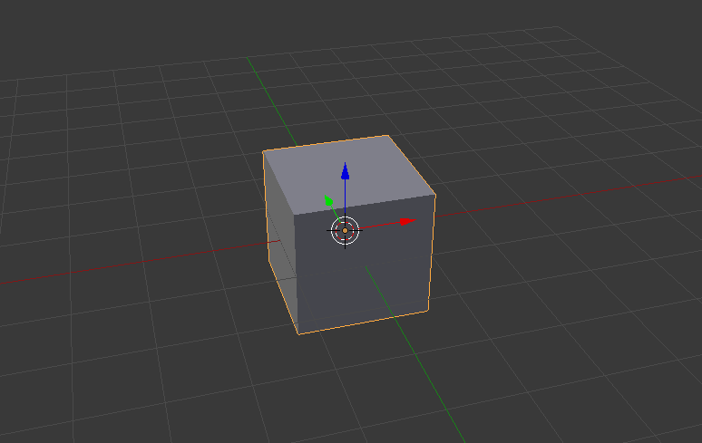

#### Then we add 3 Array Modyfier. One for Each direction.

#### Then you applay all the Modifires and then go into the Edit-Mode and Remove all the Doubles.

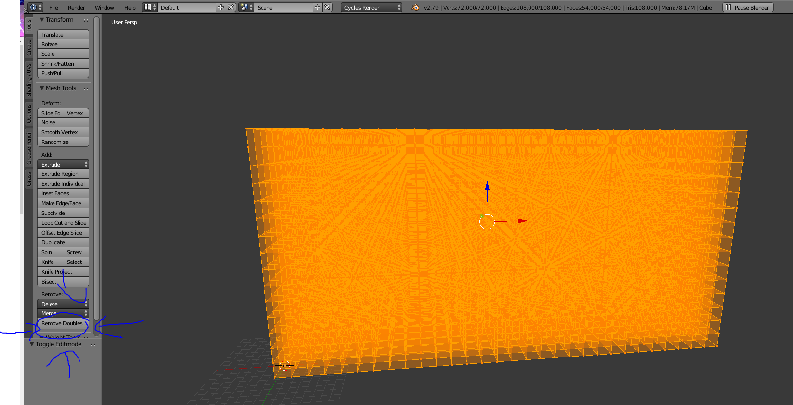

#### Then we select all the Verteces and Randmize.

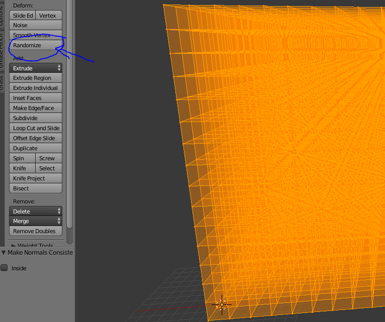

#### You can use diferent options.

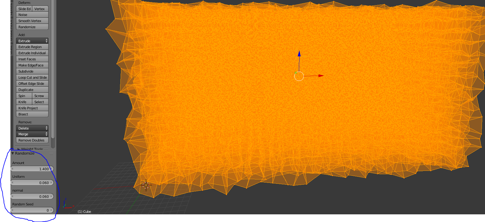

#### Then you deselect all the Verteces and then click on select Random.

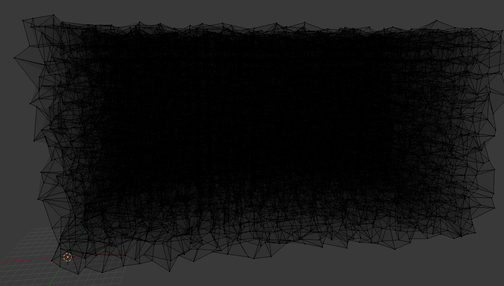

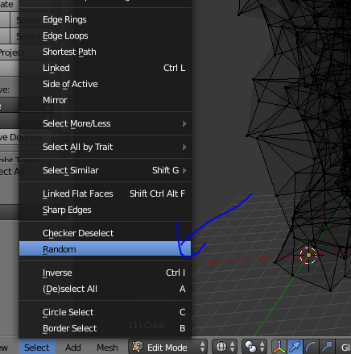

#### How many you want to select is up to you.

#### Then you delete the Verteces

#### Then you add a Wireframe Modifire to the Mesh.
#### How bit you want it to be isup to you.

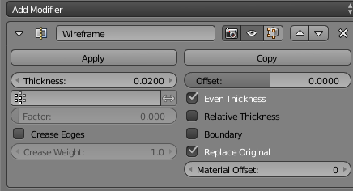

#### Then you go to a different Layer or just somewhere outside the camaras view and add a Ico Sphere.

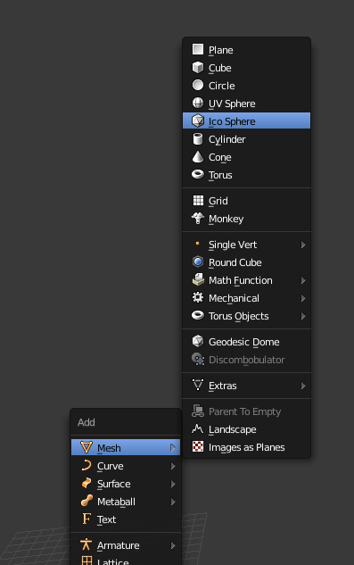

#### Then you can optonaly add a Subsurface Modifire.

### Now we come to the Texturs.

#### For the Ico Sphere i use a Principled Shader whith i set to black.

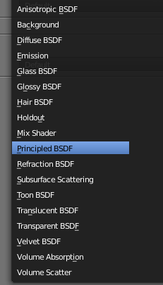

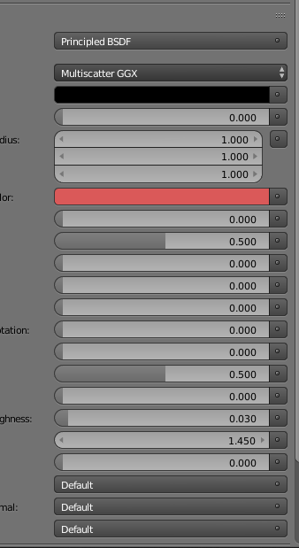

#### The World Background is set to White

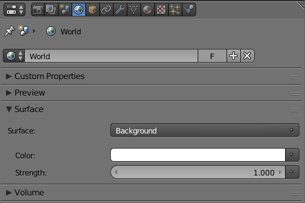

#### For the Net we set a Diffuse to Black.

### Now we will add the Ico Sphere to the mesh

#### First we need a Number.
#### For getting it we must got in the Edit Mode form the Net.
#### You find the Number on the top of the Screen.

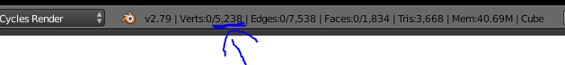

#### Then we will add a Particle system and set it to Hair, activate advanced, deactevate random and set it to Verts.
####  The "Number" has to be an Max. the number you have red out erlier.

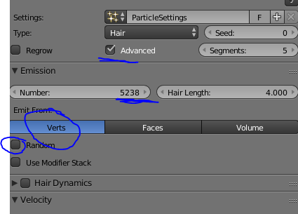

#### Then we go to Render and set it to Objekt and select the Ico Sphere we created erlier.
#### The Size setings can be canged how you like them best.

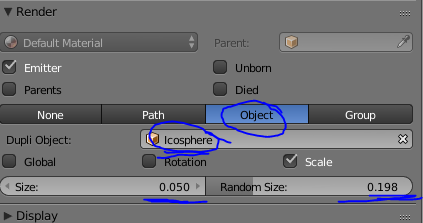

#### Now You culd make a different Net with a other size and your are done.

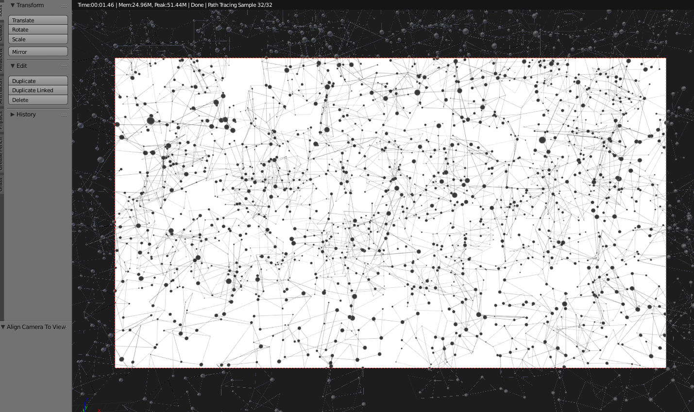

### Thanks for reading My Tutorial.
